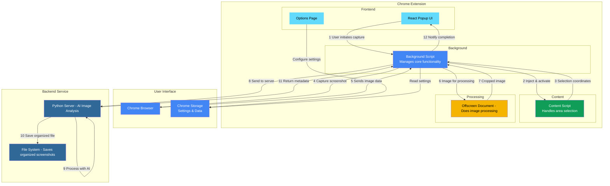
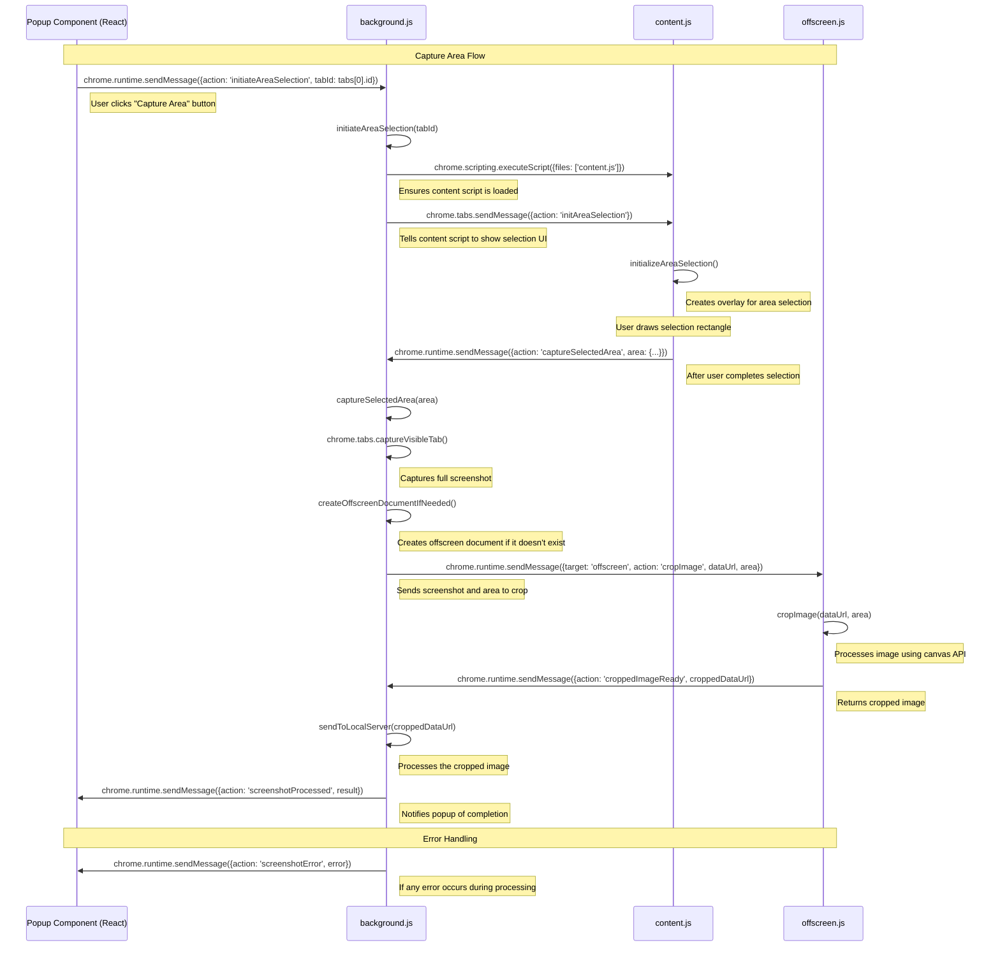

## Project Overview

A Chrome extension that captures screenshots, analyzes them with AI, and saves them with semantic names and organized folder structure
Built with React for the UI and will use a Python backend service to handle image processing with OpenAI's Vision API

#### Main Components Implemented

smart-screenshots/
├── manifest.json - Chrome extension manifest file 
├── background.js - Handles background tasks and screenshot capturing
├── content.js - Handles area selection overlay
├── React components for UI
    ├── Popup UI - Screenshot buttons and status display
    ├── Options UI - Settings for API key, folder structure, etc.

#### React based Chrome Extension Setup

Used create-react-app with react-app-rewired to customize the build process
Modified build process to create separate entry points for popup and options pages
Post-build script to create the proper Chrome extension file structure

### Key Features

#### Screenshot Capture

Capture visible area of the current tab
Area selection with a visual overlay (similar to macOS/Ubuntu)

#### Settings Management

provide OpenAI API key 
Local server URL configuration
Folder structure template customization

## Project Structure

src/
├── components/
│   ├── Popup/
│   │   ├── CaptureButtons.js
│   │   ├── StatusDisplay.js
│   │   └── Popup.js
│   └── Options/
│       ├── ApiKeyInput.js
│       ├── FolderStructureInput.js
│       ├── ServerUrlInput.js
│       └── Options.js
├── contexts/
│   └── SettingsContext.js
├── pages/
│   ├── PopupPage.js
│   └── OptionsPage.js
├── utils/
│   ├── chromeUtils.js
│   └── screenshotUtils.js
├── App.js
├── index.js
├── options-index.js
└── index.css






## Testing 

### During Development (React Development Mode)

#### Run the development server:
```bash
npm start
```

This will start the React development server, typically at http://localhost:3000. While this environment doesn't fully emulate the Chrome extension context, it's useful for rapidly developing and testing your UI components.
Test React components:

You can test the basic functionality of your React components
The popup and options UI will be visible in the browser
Note that Chrome extension APIs (like chrome.storage or chrome.tabs) won't work in this environment


### Testing the Actual Chrome Extension

#### Build the extension:
```bash
npm run build
```
This creates the production build in the build directory, structured as a Chrome extension.
Load the extension in Chrome:

Open Chrome and navigate to chrome://extensions/
- Enable "Developer mode" using the toggle in the top-right corner
- Click "Load unpacked"
- Select your project's build directory


#### Test the extension functionality:

- Click on the extension icon in Chrome's toolbar to open the popup
- Test the "Capture Visible Area" and "Select Area" buttons
- Access the options page by right-clicking the extension icon and selecting "Options" (or via the link in your popup)
- Verify that screenshots are being captured correctly
- Check that your local backend server is receiving the screenshots (when you implement that part)


### Debugging

#### View extension logs:

Open Chrome DevTools for the extension by right-clicking the extension popup and selecting "Inspect"
Watch the console for log messages and errors

#### Inspect the background page:

In chrome://extensions/, find your extension and click "service worker" under "Inspect views"
This opens DevTools for the background script

#### View content script logs:

Open the DevTools for any page where your content script is active
Your content script logs will appear in that page's console

#### Reload the extension:

After making changes and rebuilding, click the refresh icon in chrome://extensions/ to reload your extension